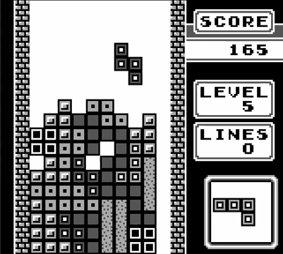
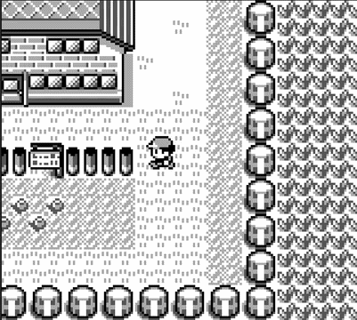
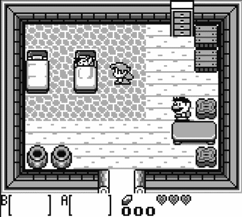
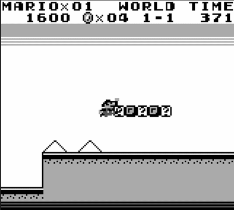

# 🕹️ SlimBoy: a highly efficient and customizable DMG emulator!

SlimBoy is a classic Game Boy emulator (DMG) focused on two aspects: efficiency and portability.
This makes it a great option for applications such as:

* PC emulation.
* Building your own Game Boy with a microcontroller (like an ESP32).
* Use the emulator as the environment for AI/RL algorithms.

If you found this project interesting or built something cool with it, please give it a star!

<table>
  <tr>
    <td></td>
    <td></td>
  </tr>
  <tr>
    <td align="center"><strong>Tetris</strong></td>
    <td align="center"><strong>Pokémon Red</strong></td>
  </tr>
  <tr>
    <td></td>
    <td></td>
  </tr>
  <tr>
    <td align="center"><strong>Link's Awakening</strong></td>
    <td align="center"><strong>Super Mario Land</strong></td>
  </tr>
</table>


✅ List of supported features:
- Full CPU instruction set.
- Full graphics support and line-by-line rendering.
- Full audio support with all 4 channels.
- Memory bank controllers 1 and 3.

⏳ List of incoming features:
- Loading saved RAM files.
- Serial support.
- Emulation pause.
- Memory bank controller 5.
- Game Boy Color support.


## How to use the emulator

All interactions with the hardware are done through an interface class.
Adapting the emulator to a new platform or use case is as simple as implementing the interface class
(and building the surrounding scaffolding code).
As a reference, the example PC implementation using SFML has fewer than 900 lines of code.
You will find this example implementation in [this
repository](https://github.com/Vicara12/GB_Emulator_PC),
I strongly encourage you to take a look if you plan to implement an interface.


### How to declare a new interface

The emulator should run in a different thread than the rest of the program.
It interacts with the main program through the interface class.
A new interface class looks like
```cpp
class MyInterface : public gb::HardwareInterface<MyInterface> {
public:

  inline void print (const std::string_view &s) {...};

  inline void println (const std::string_view &s) {...};

  inline std::string userLineInput () {...};

  inline void sleepMillis (uint t) {...};

  inline ulong realTimeMicros () {...};
  
  inline void playAudio (const gb::AudioPacket &ap) {...};
};
```
You should implement these functions, as some others are already defined in the base class
`HardwareInterface`.
If you want to know more about this design pattern, it is known as the Curiously Recurring Template
Pattern_ (CRTP).


### Starting the emulator

The emulation is started by calling the `emulator` function.
```cpp
template<class InterfaceT, bool debug>
void emulator (InterfaceT &interface, const GameRom &cartridge_data, EmulatorConfig cfg)
```
This is a template function that receives as template parameters the interface class and a boolean
for whether to execute in debug mode.
If this last flag is set to true, the emulator will print each instruction executed, along with
register values.
This might slow down the emulator unless you redirect the output to a file.

The emulator function receives the `interface` object, `cartridge_data` (a vector of the ROM bytes),
and an emulator config object, with the fields
```cpp
struct EmulatorConfig {
  bool synch_execution = true;
  bool skip_boot_room = false;
};
```
If `synch_execution` is set to true, then the emulation rate will match wall clock time; otherwise
the emulator will run as fast as possible.
Skip boot room determines whether the scrolling logo is shown or the game is executed directly.


### The main emulator loop

Several actions must be performed by the main program.
A typical emulator loop consists of the following items
```cpp
while (not exit) {
  bool exit = handleInputs(window, interface);
  // You could handle audio here, but you probably want to do it asynchronously to avoid stutter
  drawScreen(window, interface);
  if (exit) {
    // Important to wait for emulation end; games with a battery in the cartridge write their RAM to
    // the interface on the emulation end request.
    interface.requestEmulationEnd();
    while (not interface.emulationEnded()) {
      sleepMs(10);
    }
    joinEmulationThread();
    // All other cleaning you consider necessary
  }
}
```

### Text input functionalities

The functions `print` and `println` should print the string received, without and with the end of line
character.
These are not typically used, except for the cartridge description and debug mode (if enabled).

`userLineInput` should return the most recent string inputted by the user, but at this point it is
not used in the emulator at any point and can be ignored.


### Time functionalities

The function `sleepMillis` should pause execution for the given number of milliseconds.
The function `realTimeMicros` should return the current time in microseconds with respect to some
point (i.e., the beginning of the emulator's execution, but the point itself is not important).
Both these functions are called multiple times per second by the emulator, so it is important that
they are fast to execute.


### Playing audio

The function `playAudio` is called whenever a new chunk of audio data is available to play.
The sample rate, audio buffer size, and call frequency are all defined in `audio/audiostate.h`.
This function is called several times per second, so it should be fast to execute (just copying the
audio data to some buffer).
In addition, to prevent audio pops and stuttering, it is advised that audio playing is done
asynchronously.
Look at the audio module of [the sample PC interface](https://github.com/Vicara12/GB_Emulator_PC)
for a reference.


### Displaying graphics

To get the latest emulator screen available, call `getLatestScreen()` in your emulation interface.
This returns a pointer to an object of type `ScreenPixels`, defined in `graphics/graphicstate.h`,
but essentially it is an array of screen lines, a struct that contains an array of colors in its
`pixels` field.
Never delete, free, or alter this pointer, as the emulator re-uses the `ScreenPixels` objects to
prevent a new allocation on each screen frame.


### Other functionalities

As mentioned, when emulation ends, if the game ROM declares having a battery, the chunk of memory
corresponding to RAM (which stores game progress) is saved and can be obtained through the
interface's `getRAM` function.

Information on the emulation rate (er) can be obtained through the function `emuRate`, which returns the
ratio of emulation seconds executed per real-time seconds.
Thus, an er of 0.5 means that the emulator is running at half speed, and an er of 2 means the
emulator is running at double speed.


## Bugs and non-working games

Please let me know about any bugs or non-functional games you find, as well as any feature requests!